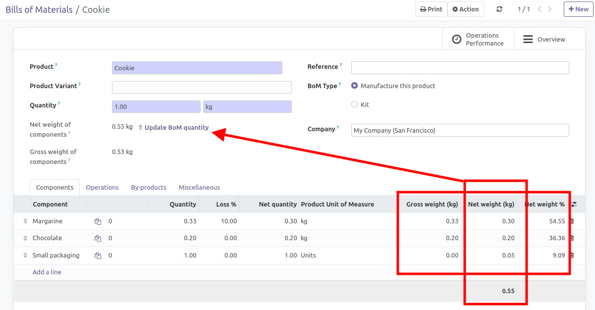

Useful for users managing weight in their product and bills of material.
Depends on mrp_bom_line_net_qty

Calculate BoM line weight this way :
- if product is a weightable product : weight is bom line weight
- if product is a unit product : weight depends on quantity and product weight and net_weight

Then, it calculate BoM components total weight.
For weightable BoM Product, it shows button to adjust BoM quantity if it's different from its components.

Works with differents unity of measures, works if you change BoM unity of measure etc.

